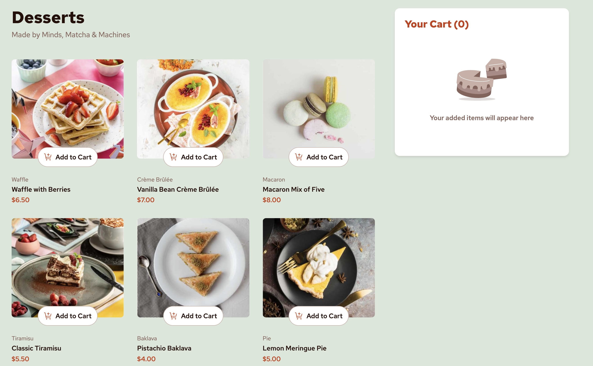

# Frontend Mentor - Product list with cart solution

This is a solution to the [Product list with cart challenge on Frontend Mentor](https://www.frontendmentor.io/challenges/product-list-with-cart-5MmqLVAp_d). Frontend Mentor challenges help you improve your coding skills by building realistic projects.

## Table of contents

- [Overview](#overview)
  - [The challenge](#the-challenge)
  - [Screenshot](#screenshot)
  - [Links](#links)
- [My process](#my-process)
  - [Built with](#built-with)
  - [What I learned](#what-i-learned)
  - [Continued development](#continued-development)
- [Author](#author)

## Overview

### The challenge

Users should be able to:

- Add items to the cart and remove them
- Increase/decrease the number of items in the cart
- See an order confirmation modal when they click "Confirm Order"
- Reset their selections when they click "Start New Order"
- View the optimal layout for the interface depending on their device's screen size
- See hover and focus states for all interactive elements on the page

### Screenshot



### Links

- Solution URL: [GitHub Repository](https://github.com/NaniSkinner/ProductListWeb.git)
- Live Site URL: [Live Demo](https://your-live-site-url.vercel.app)

## My process

### Built with

- Semantic HTML5 markup
- CSS custom properties
- CSS Grid and Flexbox
- Mobile-first responsive design
- Vanilla JavaScript (ES6+)
- Template elements for dynamic content
- Local font files (Red Hat Text)
- Async/await for data fetching

### What I learned

This project was an excellent opportunity to practice modern web development fundamentals without relying on frameworks. Here are some key learnings:

**1. Template-based Dynamic Content Generation**

```html
<template id="product-card-template">
  <article class="product-card">
    <!-- Template content that gets cloned and populated -->
  </article>
</template>
```

**2. CSS Custom Properties for Consistent Design**

```css
:root {
  --red: hsl(14, 86%, 42%);
  --rose-900: hsl(14, 65%, 9%);
  --font-weight-semibold: 600;
}
```

**3. State Management with Vanilla JavaScript**

```js
function updateCartUI() {
  const totalItems = cart.reduce((sum, item) => sum + item.quantity, 0);
  const totalPrice = cart.reduce((sum, item) => {
    const product = products[item.productId];
    return sum + product.price * item.quantity;
  }, 0);

  cartCount.textContent = totalItems;
  orderTotalAmount.textContent = `$${totalPrice.toFixed(2)}`;
}
```

**4. Responsive Design with CSS Grid**

```css
.products-grid {
  display: grid;
  grid-template-columns: repeat(auto-fit, minmax(250px, 1fr));
  gap: 1.5rem;
}
```

The most challenging aspect was managing the cart state and ensuring UI updates were synchronized across all components (product cards, cart sidebar, and order modal) without using a state management library.

### Continued development

Areas I want to focus on in future projects:

- **Performance Optimization**: Implementing virtual scrolling for large product lists
- **Accessibility**: Adding more comprehensive ARIA labels and keyboard navigation
- **Progressive Enhancement**: Adding offline functionality with Service Workers
- **Animation**: Creating more sophisticated micro-interactions and loading states
- **Testing**: Writing unit tests for cart functionality and UI components

## Author

- GitHub - [@NaniSkinner](https://github.com/naniskinner)
